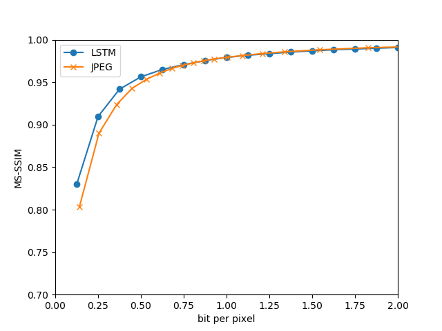
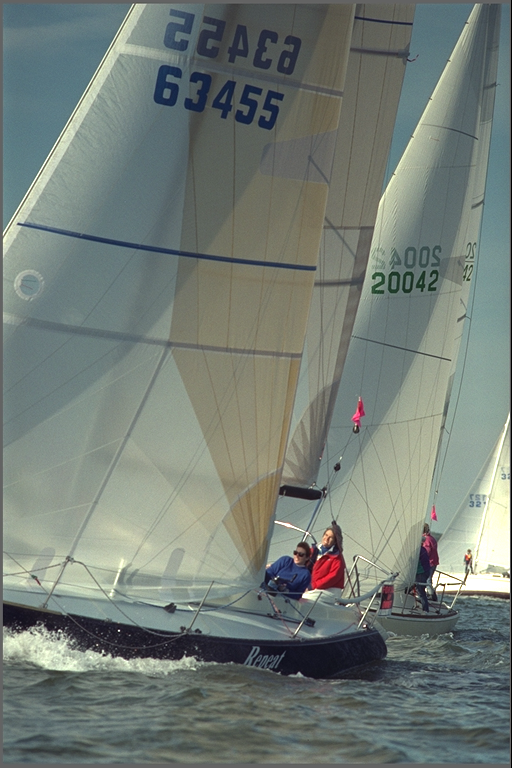
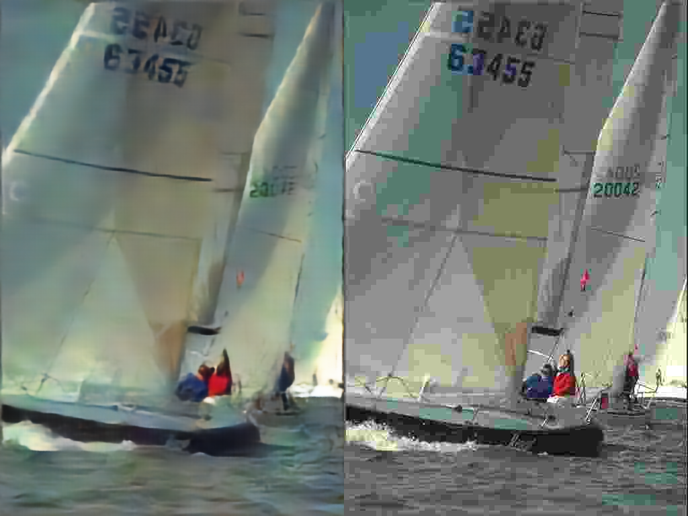
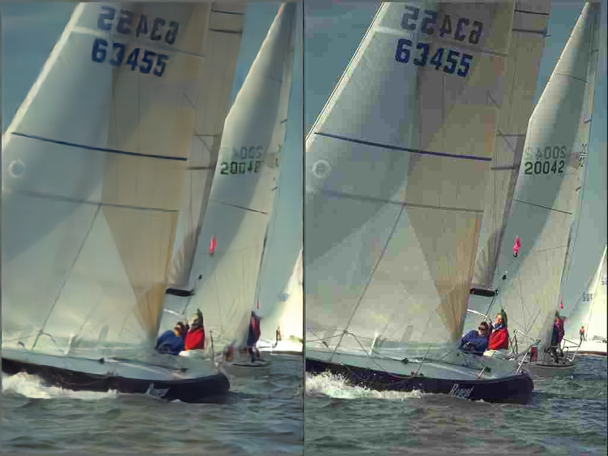
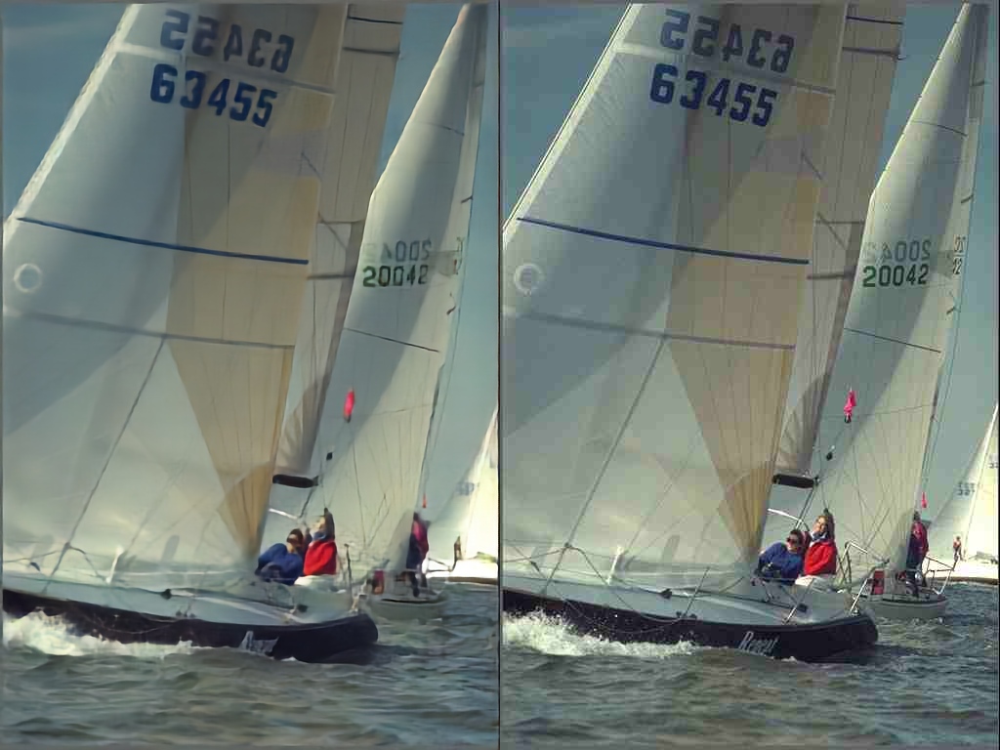

# Full Resolution Image Compression with Recurrent Neural Networks
https://arxiv.org/abs/1608.05148v2

## Requirements
- PyTorch 0.2.0

## Train
`
python train.py -f /path/to/your/images/folder/like/mscoco
`

## Encode and Decode
### Encode
`
python encoder.py --model checkpoint/encoder_epoch_00000005.pth --input /path/to/your/example.png --cuda --output ex --iterations 16
`

This will output binary codes saved in `.npz` format.

### Decode
`
python decoder.py --model checkpoint/encoder_epoch_00000005.pth --input /path/to/your/example.npz --cuda --output /path/to/output/folder
`

This will output images of different quality levels.

## Test
### Get Kodak dataset
```bash
bash test/get_kodak.sh
```

### Encode and decode with RNN model
```bash
bash test/enc_dec.sh
```

### Encode and decode with JPEG (use `convert` from ImageMagick)
```bash
bash test/jpeg.sh
```

### Calculate SSIM
```bash
bash test/calc_ssim.sh
```

### Draw rate-distortion curve
```bash
python test/draw_rd.py
```

## Result
LSTM (Additive Reconstruction), before entropy coding

### Rate-distortion


### `kodim10.png`

Original Image



Below Left: LSTM, SSIM=0.865, bpp=0.125

Below Right: JPEG, SSIM=0.827, bpp=0.133



Below Left: LSTM, SSIM=0.937, bpp=0.250

Below Right: JPEG, SSIM=0.918, bpp=0.249



Below Left: LSTM, SSIM=0.963, bpp=0.375

Below Right: JPEG, SSIM=0.951, bpp=0.381



## What's inside
- `train.py`: Main program for training.
- `encoder.py` and `decoder.py`: Encoder and decoder.
- `dataset.py`: Utils for reading images.
- `metric.py`: Functions for Calculatnig MS-SSIM and PSNR.
- `network.py`: Modules of encoder and decoder.
- `modules/conv_rnn.py`: ConvLSTM module.
- `functions/sign.py`: Forward and backward for binary quantization.

## Official Repo
https://github.com/tensorflow/models/tree/master/compression
